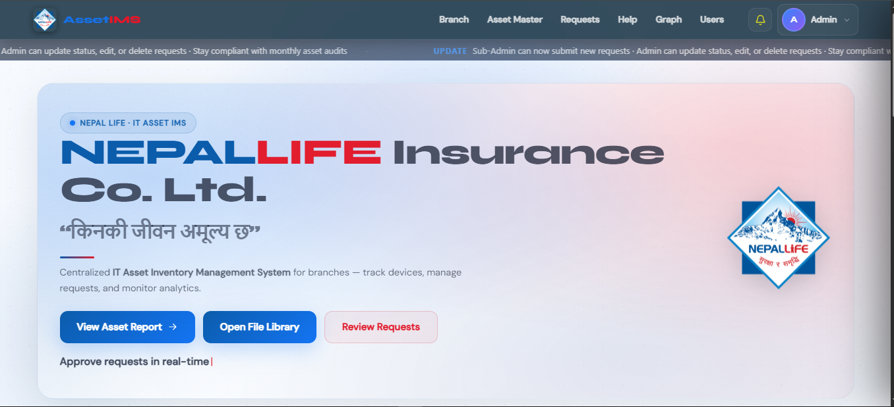
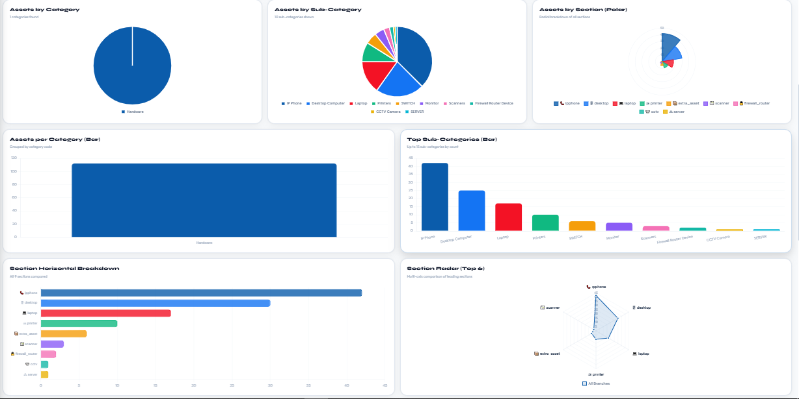
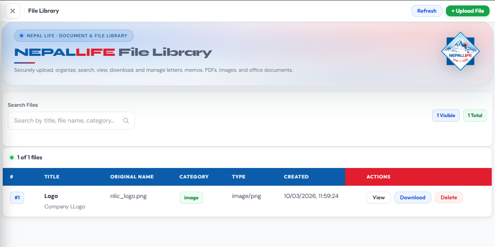
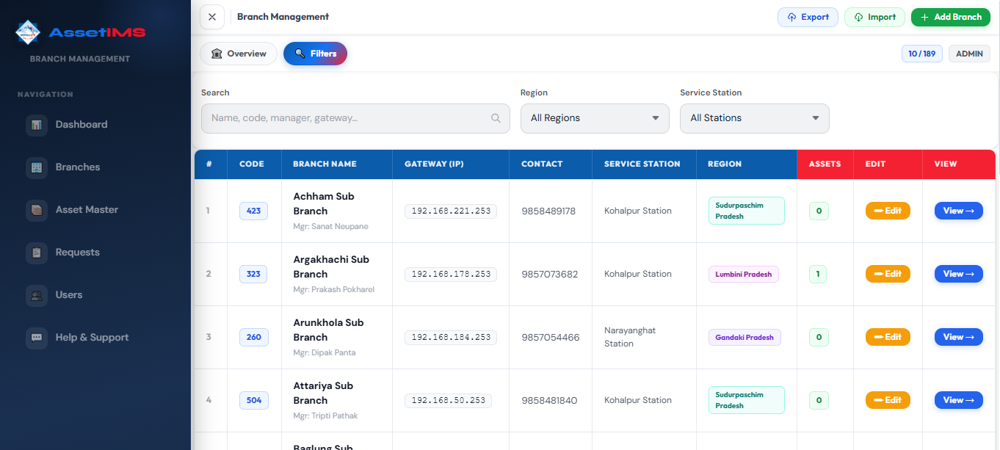
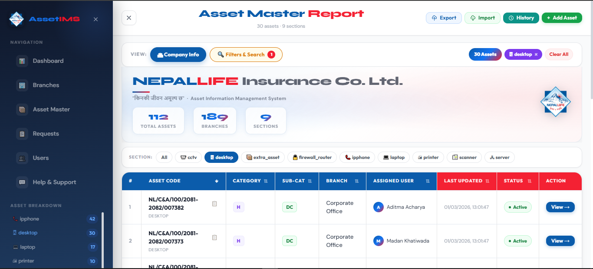
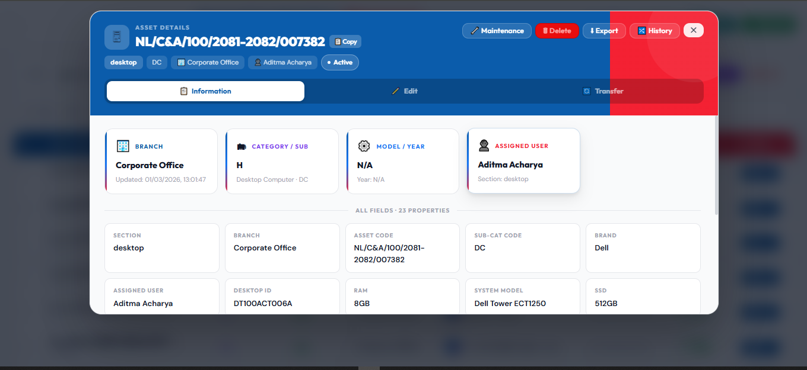
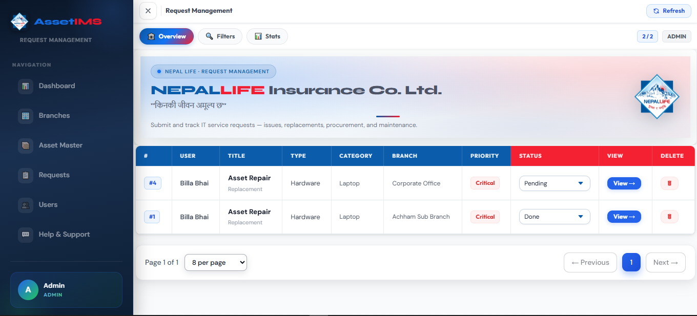
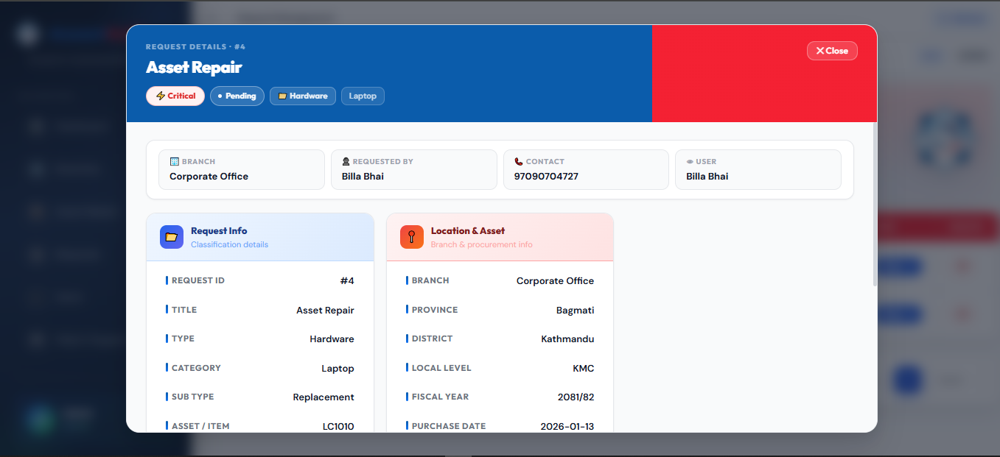
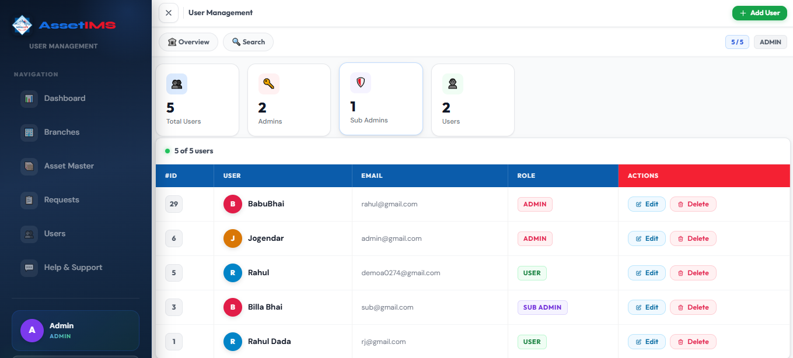
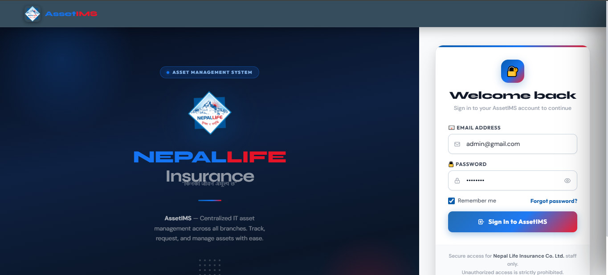

#Admin Side View 











#User Side : Sub,it help request and can view data , Not allowed to make changes.


# Sub-Admin have all access and authority as main admin except delete amd User control 
#[images are same as Admin just no delete btn].

# Project IMS - Inventory Management System

A modern, full-stack inventory management system built with React, Node.js, and MySQL. Features role-based access control, branch management, asset tracking, and more.

## 🚀 Quick Start

### Prerequisites
- Node.js 14+ and npm
- MySQL 5.7+ or MariaDB
- Git

### Setup (Windows)
```bash
# Run the setup script
setup.bat
```

### Setup (Linux/Mac)
```bash
# Make script executable
chmod +x setup.sh

# Run the setup script
./setup.sh
```

### Manual Setup

**Backend**:
```bash
cd backend
cp .env.example .env
# Edit .env with your database credentials
npm install
npm run dev
```

**Frontend**:
```bash
cd frontend
cp .env.example .env.local
npm install
npm start
```

The app will be available at `http://localhost:3000`

## 📋 Features

### User Management
- User registration and authentication
- JWT-based token system
- Role-based access control (Admin, SubAdmin, User)
- Session management

### Branch Management
- Create, read, update, delete branches
- Track branch information (manager, address, contact, region)
- View branch infrastructure
- Search and filter branches

### Asset Management
- Track company assets and inventory
- Asset categorization and grouping
- Commercial and technical details
- Software license tracking
- Asset remarks and history

### Dashboard
- Overview of all branches and assets
- Quick access to key information
- Role-specific dashboards

## 📁 Project Structure

```
project-ims/
├── frontend/                 # React frontend
│   ├── src/
│   │   ├── components/      # Reusable components
│   │   ├── pages/           # Page components
│   │   ├── services/        # API service layer
│   │   ├── context/         # React Context (Auth)
│   │   ├── hooks/           # Custom React hooks
│   │   ├── utils/           # Utility functions
│   │   └── styles/          # CSS styles
│   └── package.json
│
├── backend/                  # Node.js backend
│   ├── controllers/         # Route handlers
│   ├── models/              # Database models
│   ├── routes/              # API routes
│   ├── middleware/          # Express middleware
│   ├── utils/               # Utility functions
│   ├── config/              # Configuration
│   ├── server.js            # Server entry point
│   └── package.json
│
├── MODERNIZATION.md         # Modernization details
├── API_DOCUMENTATION.md     # API reference
├── README.md               # This file
├── setup.bat               # Windows setup script
└── setup.sh                # Linux/Mac setup script
```

## 🔐 Authentication & Authorization

### Roles
- **Admin**: Full access to all features
- **SubAdmin**: Manage branches and assets
- **User**: View branches and assets (read-only)

### Login
```javascript
POST /api/auth/login
{
  "email": "user@example.com",
  "password": "password123"
}
```

## 📚 Documentation

- [**API Documentation**](API_DOCUMENTATION.md) - Complete API reference
- [**Modernization Guide**](MODERNIZATION.md) - What's new and how to use modern features
- [**Setup Guide**](SETUP.md) - Detailed setup instructions

## 🛠️ Tech Stack

### Frontend
- **React** 18.2+ - UI framework
- **React Router** 6+ - Client-side routing
- **Axios** - HTTP client
- **Lucide React** - Icons

### Backend
- **Node.js** - Runtime
- **Express** 4.18+ - Web framework
- **Sequelize** 6+ - ORM
- **MySQL2** - Database driver
- **JWT** - Authentication
- **bcryptjs** - Password hashing
- **CORS** - Cross-origin requests
- **Helmet** - Security headers
- **Morgan** - Request logging

## 🔌 API Endpoints

### Authentication
- `POST /api/auth/register` - Register new user
- `POST /api/auth/login` - Login user

### Branches
- `GET /api/branches` - Get all branches
- `GET /api/branches/:id` - Get branch by ID
- `POST /api/branches` - Create branch (admin/subadmin)
- `PUT /api/branches/:id` - Update branch (admin/subadmin)
- `DELETE /api/branches/:id` - Delete branch (admin only)

### Assets
- `GET /api/assets` - Get all assets
- `GET /api/assets/:id` - Get asset by ID
- `POST /api/assets` - Create asset (admin/subadmin)
- `PUT /api/assets/:id` - Update asset (admin/subadmin)
- `DELETE /api/assets/:id` - Delete asset (admin only)

See [API_DOCUMENTATION.md](API_DOCUMENTATION.md) for complete endpoint reference.

## 🎯 Modern Features Added

### Frontend
✅ Custom React hooks for form management
✅ Reusable UI components
✅ Form validation with error display
✅ Loading states and skeleton screens
✅ Alert/notification system
✅ API interceptors with error handling
✅ Debounced search
✅ Modal-based workflows
✅ Consistent response handling

### Backend
✅ Input validation on all endpoints
✅ Consistent response formatting
✅ Proper HTTP status codes
✅ Error logging with timestamps
✅ Environment-based configuration
✅ Async error handling
✅ Security headers

## 🚀 Development

### Running the Dev Servers

**Terminal 1 - Backend**:
```bash
cd backend
npm run dev
```

**Terminal 2 - Frontend**:
```bash
cd frontend
npm start
```

### Build for Production

**Backend**:
```bash
cd backend
npm start
```

**Frontend**:
```bash
cd frontend
npm run build
```

## 📝 Environment Variables

### Backend (.env)
```
DB_HOST=localhost
DB_PORT=3306
DB_NAME=project_ims
DB_USER=root
DB_PASSWORD=your_password
JWT_SECRET=your-secret-key
PORT=5000
NODE_ENV=development
```

### Frontend (.env.local)
```
REACT_APP_API_URL=http://localhost:5000
REACT_APP_ENV=development
```

## 🐛 Troubleshooting

### Port Already in Use
```bash
# Change frontend port
PORT=3001 npm start

# Change backend port
PORT=5001 npm run dev
```

### Database Connection Error
- Verify MySQL is running
- Check .env credentials match your MySQL setup
- Ensure database exists: `CREATE DATABASE project_ims;`

### CORS Errors
- Verify REACT_APP_API_URL matches backend URL
- Check backend is running on expected port
- Ensure CORS middleware is enabled in backend

### Module Not Found
```bash
# Reinstall dependencies
rm -rf node_modules package-lock.json
npm install
```

## 📊 Database Schema

The system uses the following main models:
- **User** - System users with roles
- **Branch** - Company branches
- **Asset** - Inventory items
- **AssetGroup** - Asset categories
- **Department** - Company departments
- **BranchInfra** - Branch infrastructure records

## 🔒 Security Features

✅ Password hashing with bcryptjs
✅ JWT token-based authentication
✅ Role-based access control (RBAC)
✅ CORS protection
✅ Security headers (Helmet)
✅ Rate limiting
✅ Input validation
✅ Async error handling

## 📈 Performance Optimizations

✅ Debounced search
✅ Lazy loading components
✅ API request caching
✅ Skeleton loaders for better UX
✅ Efficient database queries with associations

## 🤝 Contributing

1. Create a feature branch: `git checkout -b feature/name`
2. Commit changes: `git commit -m 'Add feature'`
3. Push to branch: `git push origin feature/name`
4. Submit a pull request

## 📄 License

This project is proprietary and confidential.

## 📞 Support

For issues, questions, or suggestions:
1. Check the documentation files
2. Review the troubleshooting section
3. Check API logs for errors
4. Verify environment configuration

## 🗺️ Future Roadmap

- [ ] TypeScript migration
- [ ] Advanced filtering and search
- [ ] Export to CSV/Excel
- [ ] Audit logging
- [ ] Two-factor authentication
- [ ] Mobile app
- [ ] Real-time notifications
- [ ] Advanced reporting
- [ ] Automated backups
- [ ] Multi-language support

## 👥 Team

Developed with modern best practices and industry standards.

---

**Version**: 2.0.0 (Modernized)
**Last Updated**: December 9, 2025
**Status**: ✅ Production Ready


